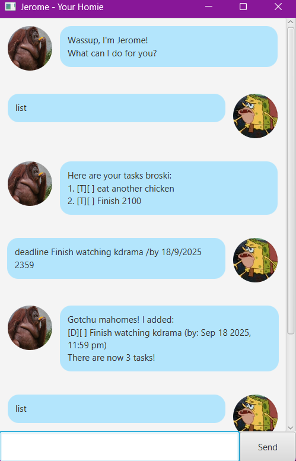

# Jerome User Guide

**Product Screenshot**  


---

**Product Introduction**

Jerome is a chatbot built using **JavaFX** and graphical user interface (GUI). This project is designed to handle *dynamic* user input and provide conversational responses in an engaging manner, and store tasks and track deadlines.

> *"Your friendly homie to help with tasks!"*

---
# Features

## Adding Tasks
Describes how to add a new task to your list (todo, deadline, event, etc.). This command creates the task, updates the list, and confirms success.

### Example usage
```
event biz seminar /from 19/9/2025 0800 /to 21/9/2025 1900
```
### Expected Outputs
```
Gotchu mahomes! I added:
  [T][X] read book
  [D][ ] finish assignment (by: 18/9/2025 11:59 pm)
  [E][ ] biz seminar (from: 19/9/2025 08:00 am to: 21/9/2025 7:00 pm)
There are now 3 task(s)!
```
---
## Marking Tasks
Marks an existing task in your list as completed/uncompleted. This command updates the task’s status and confirms the action.

### Example usage
```
mark 2
```
### Expected Outputs
```
Sheesh what a productive monkey you are.
Nice! I've marked this task as done:
[D][X] finish assignment (by: 18/9/2025 11:59 pm)
```
---
## Finding Tasks
Searches for tasks containing the specified keyword(s) in their descriptions. This helps locate relevant tasks easily.

### Example usage
```
find assignment
```
### Expected Outputs
```
Here are the matching tasks in your list:
1.[D][ ] finish assignment (by: 18/9/2025 11:59 pm)
```
---

## Listing Tasks
Displays all tasks currently stored in the task list, showing their status and details.

### Example usage
```
list
```

### Expected Outputs
```
Here are your tasks broski:
1.[T][X] read book
2.[D][X] finish assignment (by: 18/9/2025 11:59 pm)
3.[E][ ] biz seminar (from: 19/9/2025 08:00 am to: 21/9/2025 7:00 pm)
```
___
## Deleting tasks
Removes a specified task from the task list by its index. This command updates the list, saves changes, and confirms removal. An error is shown if the index is invalid.
### Example usage
```
delete 2
```

### Expected Outputs
```
Alright matey! I have removed this task:
  [D][ ] finish assignment (by: 18/9/2025 11:59 pm)
There are now 2 task(s)!
```
---

## Exiting Program
Exits the program using the bye command.
```
bye
```
### Expected Outputs
```
Bye gng. Dap a homie up before you go will ya!
```

---

# Other features
##  Improve searching with fuzzy matching

The find feature now supports fuzzy matching. This means when you search for tasks, tasks that are very close to your search term, even with minor typos or spelling differences, are included as results. 

```
find finsh assignment
```
### Expected output
```
Here are the matching tasks in your list:
1.[D][ ] finish assignment (by: 18/9/2025 11:59 pm)
```

___
## Setup
### Clone the repo

```bash
# Clone the repository
git clone https://github.com/Ruileirei/ip.git

# Navigate into project
cd ip

# Build and run using Gradle
./gradlew run
```
### With jar

### 1. Download the JAR File
- Download the JAR file from [here](https://github.com/Ruileirei/ip/releases/tag/v0.3)
### 2. Run the JAR File
- **Double-click** the downloaded JAR file to run the application.
### 3. Add Your Tasks
- Once the application is launched, you can add your tasks and let the chatbot manage them for you! 😉
---
